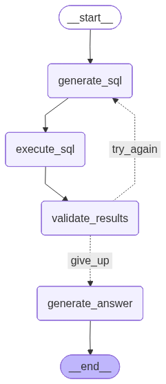

# University SQL Agent

An agentic AI system built with **LangGraph** that translates natural language questions into SQL, executes them against a SQLite database, and autonomously self-corrects if errors occur.

## Overview
Traditional Text-to-SQL systems often fail when the LLM hallucinates schema names or writes invalid syntax. This project solves that by implementing a **Reflection Pattern**: the agent "thinks," "acts," and then "evaluates" its own work before presenting the final answer to the user.

---

## Agentic Design Patterns
This project implements several agentic patterns to ensure reliability:

### 1. Reflection (Self-Correction)
 The system does not assume the first output is correct. It uses a "Validator" node to critique the SQL results. To prevent bias, the Validator LLM comes from a different provider than the one generating the answer. If the validator detects an error (empty results, syntax errors, or logic mismatches), it triggers a retry loop. The `validate_results` node checks the output of `execute_sql`. If invalid, it routes back to `generate_sql` for a fix.
* **Real-Life Application:** This is based off the Auditor concept. In real life, it is hard for a company to self-audit because of bias & retributions, this is why Audits are perfomerd by external companies. This concept can be used to any solution generated by an LLM: bring another, independant LLM that will review the answers and validate/invalidate the output. In a more and more automated world, this will ensure the quality of answers, lower the risk of AI-hallucination and false output.

### 2. Tool Use (Function Calling)
The agent is empowered to interact with external environments, here a database, to deliver info to the user. The agent uses a custom SQL execution tool to interact with the `university.db` SQLite database.
* **Real-Life Application:** The Legendary Goal of Analytics has been for 10 years to reach the 'Self-Service' level, i.e, users should be able to find their information without help. With an AI Agent able to query a database, users can now ask a database in natural language and get answers easily and quickly.

### 3. Memory Persistence
The Agent maintains a memory of the conversation, which enables him to keep context and be efficient on a back-and-forth discussion with a user. Using `MemorySaver`, keep track of the previous questions/answers and keep the coherence up.
* **Real-Life Example:** GenAI can already uses this pattern to solve complex problems one chunk at a time. A user can divide his work into several parts and work on them one at a time. Because the Agent will retain memory of the previous questions and answers, it can tackle efficiently each chunk of the problem and keep coherence between all blocks.

### 4. Dynamic Routing
Instead of a straight line, the agent uses logic to "route" the user to the best possible path. It’s like a smart switchboard that evaluates the input and sends it to the right department. If the provided answer is not deemed valid, the conditional node will reroute the next step to a 'try-again'.
* **Real-Life Example:** A Customer Service Bot. Depending on the discussion with the user, a bot could decide to take it that way or that way, to answer the customer's specific request and his particular situation

---

## System Architecture
The agent follows a circular flow to ensure accuracy:

1. **Generate SQL:** Interprets user intent and conversation history.
2. **Execute SQL:** Interacts with the SQLite database.
3. **Validate:** A dedicated LLM "grades" the result.
4. **Logic Loop:** - `happy` -> Proceed to Answer.
    - `try_again` -> Return to step 1 (Max 3 attempts).
    - `give_up` -> Proceed to Answer with current context.

---

## Installation & Setup

1. **Clone the repository:**
   git clone <your-repo-link>
   cd university_agent

2. **Install Dependencies**
    pip install -r requirements.txt

3. **API Configuration**
    Create a .env file in the root directory:
    OPENAI_API_KEY=your_openai_key
    GROQ_API_KEY=your_groq_key

4. **Database Initialization**
    python src/database_setup.py

5. **Run the Application**
    python app.py